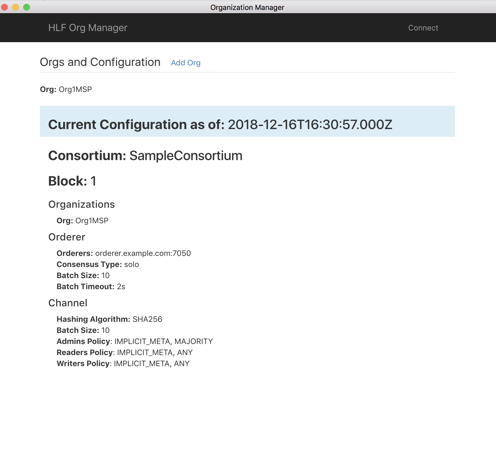

# Byzantine-config

Hyperledger fabric configuration and organization update GUI based executable application. 

### Installation 

Download desired platform installation binary and execute. 

### Source Code 

Source code can be found at this repository [https://github.com/in-the-keyhole/byzantine-config-source](https://github.com/in-the-keyhole/byzantine-config-source)

### Usage 

Updating a Hyperledger Fabric network configuration and adding/updating organizations requires a configuration block to be defined, signed and then executed as an update config transaction. Doing this manually with CLI tools can be complex and cumbersome.   

Byantine-config provides an executable `GUI` application that greatly simplifies updating and adding Organizations. When invoked an initial connect screen will appear.  You will need a network peer node address, Userid, access to your private key, and Fabric Binaries 

Once connected the current configuration block is displayed... 

Clicking the `add` and an org link will prompt for new Org name and properties, input desired values then click generate.

Crypto artifacts for the new Org and an `updated config block `<your org>_update_in_envelop.pb` will be generated. This config PB will need to besigned by the consortium based upon policy settings. 

